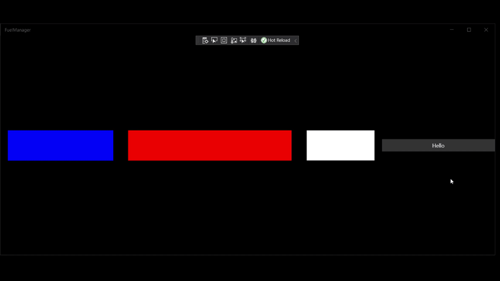

# Flex
A flexbox implementation for the UWP app framework.

- Flex extends Panel and uses Facebook Yoga for calculating the right size and position of the items.
- Support design time rendering in xaml editors



## Flex properties (container)

| Property       | Type                                                                                                | Default   |
|----------------|-----------------------------------------------------------------------------------------------------|-----------|
| Direction      | enum = Row \| Column \| RowReverse \| ColumnRevers                                                  | Row       |
| Wrap           | enum = Wrap \| NoWrap \| WrapReverse                                                                | NoWrap    |
| JustifyContent | enum = FlexStart \| FlexEnd \| Center \| SpaceBetween \| SpaceAround                                | FlexStart |
| AlignItems     | enum = Auto \| FlexStart \| FlexEnd \| Center \| SpaceBetween \| SpaceAround \| Stretch \| BaseLine | Stretch   |
| AlignContent   | enum = Auto \| FlexStart \| FlexEnd \| Center \| SpaceBetween \| SpaceAround \| Stretch \| BaseLine | FlexStart |

## Attachable properties on children

| Property   | Type                                                                                                | Default |
|------------|-----------------------------------------------------------------------------------------------------|---------|
| Grow       | int                                                                                                 | 0       |
| Shrink     | int                                                                                                 | 0       |
| AlignSelf  | enum = Auto \| FlexStart \| FlexEnd \| Center \| SpaceBetween \| SpaceAround \| Stretch \| BaseLine | Auto    |
| HeightUnit | enum = Percentage \| Point                                                                          | Point   |
| WidthUnit  | enum = Percentage \| Point                                                                          | Point   |
| BasisUnit  | enum = Percentage \| Point                                                                          | Point   |
| FlexWidth  | float                                                                                               | NaN     |
| FlexHeight | float                                                                                               | NaN     |
| FlexBasis  | float                                                                                               | NaN     |

## Example usage

example usage
```xaml
<Page
    x:Class="FlexApp.MainPage"
    xmlns="http://schemas.microsoft.com/winfx/2006/xaml/presentation"
    xmlns:x="http://schemas.microsoft.com/winfx/2006/xaml"
    xmlns:d="http://schemas.microsoft.com/expression/blend/2008"
    xmlns:local="using:FuelManager"
    xmlns:mc="http://schemas.openxmlformats.org/markup-compatibility/2006"
    xmlns:yoga="using:YogaFlex.UWP"
    MinWidth="100"
    Background="{ThemeResource ApplicationPageBackgroundThemeBrush}"
    mc:Ignorable="d">

    <Grid>
        <yoga:Flex
            AlignContent="Center"
            AlignItems="Center"
            Direction="Row"
            JustifyContent="Center"
            Wrap="Wrap">
            <yoga:Flex.ChildrenTransitions>
                <TransitionCollection>
                    <ReorderThemeTransition />
                </TransitionCollection>
            </yoga:Flex.ChildrenTransitions>
            <Rectangle
                Margin="10"
                yoga:Flex.FlexHeight="100"
                yoga:Flex.FlexWidth="25"
                yoga:Flex.Shrink="0"
                yoga:Flex.WidthUnit="Percentage"
                Fill="Blue" />
            <Rectangle
                Width="300"
                Margin="10"
                yoga:Flex.FlexHeight="100"
                yoga:Flex.Grow="1"
                yoga:Flex.Shrink="0"
                Fill="Red" />
            <Rectangle
                MinWidth="200"
                Margin="10,10"
                yoga:Flex.FlexHeight="100"
                yoga:Flex.FlexWidth="200"
                yoga:Flex.Shrink="1"
                Fill="White" />
            <Button
                Width="300"
                HorizontalAlignment="Stretch"
                yoga:Flex.Shrink="1">
                Hello
            </Button>

        </yoga:Flex>
    </Grid>
</Page>
```

## Todo
- Absolute positioning
- Aspect ratio implementation
